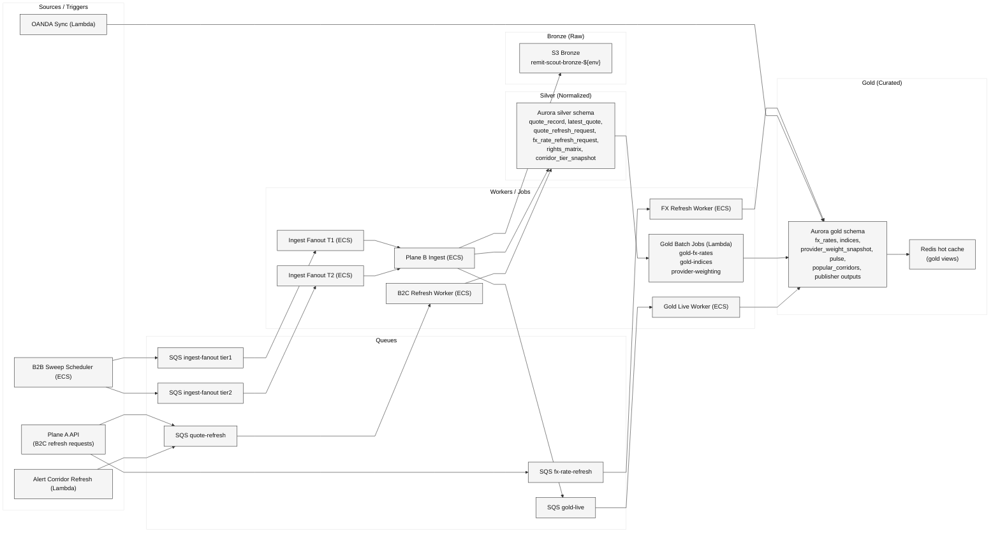
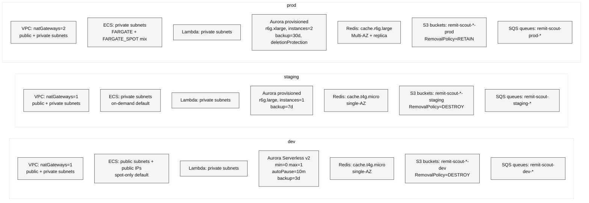

# Remit-Scout Backend Architecture — Master Diagram (Single View)

Source of truth: `infrastructure/cdk/**` + `backend/**`.

```mermaid
%%{init: {'flowchart': {'curve': 'linear', 'nodeSpacing': 40, 'rankSpacing': 60}, 'theme': 'base', 'themeVariables': {'lineColor': '#333333', 'lineWidth': '2', 'primaryTextColor': '#111111', 'primaryBorderColor': '#333333', 'primaryColor': '#F5F5F5'}}}%%
flowchart LR
  %% Edge / API
  subgraph EDGE["Edge / API"]
    direction TB
    CLIENTS["Clients / Partners"]
    ADMINS["Ops / Admins"]
    CF["CloudFront (optional)\nplaneACloudFront"]
    WAF["WAF (optional)\nplaneAWaf"]
    API_A["HTTP API Gateway: Plane A\nplaneAApi"]
    API_C["HTTP API Gateway: Plane C\nplaneCApi"]
  end

  %% API Lambdas
  subgraph API_RT["API Runtimes (Lambda)"]
    direction TB
    LAMBDA_A["Lambda: Plane A\nbackend/plane-a\napp.ts"]
    LAMBDA_C["Lambda: Plane C\nbackend/plane-c\napp.ts"]
  end

  %% EventBridge + Scheduled Jobs
  subgraph SCHEDULES["EventBridge + Scheduled Jobs"]
    direction TB
    EB["EventBridge Rules\nremit-scout-${env}-*"]
    JOBS_A["Plane A Scheduled Lambdas\nexport-worker\nalert-evaluation-scheduler (daily/weekly)\nalert-evaluation-worker\nalert-corridor-refresh\ntelemetry-analytics\nsession-cleanup\nbank-vs-specialist-refresh\naudit-log-cleanup\noanda-sync"]
    JOBS_B["Plane B Scheduled Lambdas\ngold-fx-rates\nsmart-alerts\ngold-popular-corridors\ngold-pulse-cache\nb2c-retry-failed\nb2c-queue-cleanup\nstoplist-auto-resume\nrights-matrix-sync-countries"]
    JOBS_C["Plane C Scheduled Lambdas\ngold-publisher\ngold-indices\nprovider-weighting\ndata-health-slo\ngold-reconciliation"]
    PROBES["Provider Probe Lambdas\nremitly, westernunion, wise, worldremit\nria, dahabshiil, sendwave, mukuru\nxe, alansari, instarem, xoom\nremitbee, singx, placid, koronapay\nwirebarley, intermex"]
    ECS_B2B_SWEEP["ECS Scheduled Task\nb2b-sweep-scheduler\n(b2b-sweep-scheduler-ecs.ts)"]
  end

  %% ECS Workers
  subgraph ECS["ECS Workers (Fargate)"]
    direction TB
    ECS_INGEST["Plane B Ingest\nplane-b-ingest-ecs.ts\nrunIngestion"]
    ECS_FANOUT_T1["Ingest Fanout Tier1\ningest-fanout-worker-ecs.ts\nrunIngestFanoutWorkerLoop"]
    ECS_FANOUT_T2["Ingest Fanout Tier2\ningest-fanout-worker-ecs.ts\nrunIngestFanoutWorkerLoop"]
    ECS_B2C["B2C Refresh Worker\nb2c-refresh-worker-ecs.ts\nrunB2cRefreshWorkerLoop\n(service + scheduled task)"]
    ECS_FX["FX Refresh Worker\nfx-rate-refresh-worker-ecs.ts\nrunFxRateRefreshWorkerLoop\n(service + scheduled task)"]
    ECS_GOLD_LIVE["Gold Live Worker\ngold-live-worker-ecs.ts\nrunGoldLiveWorker"]
    ECS_NOTIF["Notifications Worker\nnotifications-queue-worker-ecs.ts\nrunNotificationsQueueWorkerLoop"]
    ECS_OPS["Ops Alerts Worker\nops-alerts-queue-worker-ecs.ts\nrunOpsAlertsQueueWorkerLoop"]
  end

  %% Queues
  subgraph SQS["SQS Queues + DLQs"]
    direction TB
    Q_QUOTE["quote-refresh\nremit-scout-${env}-quote-refresh\nDLQ: ...-quote-refresh-dlq"]
    Q_FX["fx-rate-refresh\nremit-scout-${env}-fx-rate-refresh\nDLQ: ...-fx-rate-refresh-dlq"]
    Q_EXPORT["export-job\nremit-scout-${env}-export-job\nDLQ: ...-export-job-dlq"]
    Q_ALERT["alert-evaluation\nremit-scout-${env}-alert-evaluation\nDLQ: ...-alert-evaluation-dlq"]
    Q_INGEST_T1["ingest-fanout (tier1)\nremit-scout-${env}-ingest-fanout\nDLQ: ...-ingest-fanout-dlq"]
    Q_INGEST_T2["ingest-fanout (tier2)\nremit-scout-${env}-ingest-fanout-tier2\nDLQ: ...-ingest-fanout-tier2-dlq"]
    Q_GOLD_LIVE["gold-live\nremit-scout-${env}-gold-live\nDLQ: ...-gold-live-dlq"]
    Q_NOTIF["notifications\nremit-scout-${env}-notifications\nDLQ: ...-notifications-dlq"]
    Q_OPS["ops-alerts\nremit-scout-${env}-ops-alerts\nDLQ: ...-ops-alerts-dlq"]
  end

  %% Data Stores
  subgraph DATA["Data Stores"]
    direction TB
    DB_AURORA["Aurora Postgres\nremit_scout\nSilver + Gold schemas"]
    DB_PROXY["RDS Proxy (optional)"]
    REDIS["ElastiCache Redis\nTLS enabled"]
    S3_BRONZE["S3 Bronze\nremit-scout-bronze-${env}"]
    S3_EXPORTS["S3 Exports\nremit-scout-exports-${env}"]
    S3_USER_ASSETS["S3 User Assets\nremit-scout-user-assets-${env}"]
    S3_AUDIT["S3 Audit Logs\nremit-scout-audit-logs-${env}"]
  end

  %% Observability
  subgraph OBS["Observability + Alerts (cross-cutting)"]
    direction TB
    OBS_SOURCES["All Lambdas + ECS\n(logs/metrics/traces)"]
    CW_DASH["CloudWatch Dashboard\nremit-scout-${env}"]
    CW_ALARMS["CloudWatch Alarms\nAPI p95/5xx, SQS depth/DLQ\nSLOs (freshness, indices), probe heartbeats\nECS CPU/Mem, RDS, Redis"]
    SYN["Synthetics Canaries\nhealth, quotes, indices"]
    SNS_CRIT["SNS: alerts-critical"]
    SNS_WARN["SNS: alerts-warning"]
    SNS_OPS["SNS: alerts-ops"]
    XRAY["Tracing: X-Ray / OTel (if enabled)"]
  end

  %% Cost guardrails
  subgraph COST["Cost Guardrails"]
    direction TB
    CUR["CUR Bucket\nremit-scout-${env}-cur"]
    BUDGET["Budget (monthly)"]
    ANOMALY_MON["Cost Anomaly Monitor"]
    ANOMALY_SUB["Cost Anomaly Subscription"]
  end

  %% Runtime state (verified)
  subgraph RUNTIME["Runtime State (dev/us-east-1)"]
    direction TB
    RT_VER["Verified: 2026-02-05"]
    RT_STACK["Stack: UPDATE_COMPLETE"]
    RT_DRIFT["Drift: DRIFTED (5)\n- OpsPauseParam=true\n- gold-fx-rates rule disabled\n- gold-indices rule disabled\n- CloudFront tags missing\n- CW dashboard tags missing"]
    RT_ECS["ECS services: desired=0 (all 8)"]
    RT_RULES["EventBridge rules: 35 disabled"]
    RT_SQS["SQS queues: 18/18 present"]
  end

  %% Networking
  subgraph NET["Networking (VPC + Security Groups)"]
    direction TB
    VPC["VPC: RemitScoutVpc\nprivate + public subnets"]
    SUBNET_PUBLIC["Public Subnets"]
    SUBNET_PRIVATE["Private Subnets (WITH_EGRESS)"]
    SG_A["SG: PlaneA"]
    SG_B["SG: PlaneB"]
    SG_C["SG: PlaneC"]
    SG_DB["SG: Database"]
    SG_REDIS["SG: Redis"]
    VPC_EP["VPC Endpoints\nS3, ECR, Logs, Secrets, SSM, STS"]
  end

  %% Edge wiring
  CLIENTS --> CF --> WAF --> API_A
  CLIENTS --> API_C
  ADMINS --> API_A
  ADMINS --> API_C
  API_A --> LAMBDA_A
  API_C --> LAMBDA_C

  %% Plane A runtime -> queues + data
  LAMBDA_A --> DB_AURORA
  LAMBDA_A --> REDIS
  LAMBDA_A --> S3_USER_ASSETS
  LAMBDA_A --> Q_QUOTE
  LAMBDA_A --> Q_FX
  LAMBDA_A --> Q_EXPORT

  %% Plane C runtime -> data
  LAMBDA_C --> DB_AURORA
  LAMBDA_C --> REDIS

  %% EventBridge -> scheduled jobs
  EB --> JOBS_A
  EB --> JOBS_B
  EB --> JOBS_C
  EB --> PROBES
  EB --> ECS_B2B_SWEEP

  %% Scheduled jobs -> queues/data
  JOBS_A -->|alert-evaluation-scheduler| Q_ALERT
  Q_ALERT -->|alert-evaluation-worker| JOBS_A
  JOBS_A -->|alert-corridor-refresh| Q_QUOTE
  Q_EXPORT -->|export-worker| JOBS_A

  %% B2B sweep -> ingest fanout queues
  ECS_B2B_SWEEP --> Q_INGEST_T1
  ECS_B2B_SWEEP --> Q_INGEST_T2

  %% Ingest fanout -> Plane B ingest
  Q_INGEST_T1 --> ECS_FANOUT_T1 --> ECS_INGEST
  Q_INGEST_T2 --> ECS_FANOUT_T2 --> ECS_INGEST

  %% Plane B ingest -> data/queues
  ECS_INGEST --> S3_BRONZE
  ECS_INGEST --> DB_AURORA
  ECS_INGEST --> Q_GOLD_LIVE
  ECS_INGEST --> Q_OPS

  %% B2C / FX refresh workers consume queues
  Q_QUOTE --> ECS_B2C --> DB_AURORA
  Q_FX --> ECS_FX --> DB_AURORA

  %% Gold live queue -> worker -> DB/Redis
  Q_GOLD_LIVE --> ECS_GOLD_LIVE --> DB_AURORA
  ECS_GOLD_LIVE --> REDIS

  %% Notifications / ops alerts queues
  Q_NOTIF --> ECS_NOTIF --> DB_AURORA
  Q_OPS --> ECS_OPS --> DB_AURORA

  %% Gold jobs -> DB/Redis
  JOBS_B --> DB_AURORA
  JOBS_C --> DB_AURORA
  JOBS_B --> REDIS
  JOBS_C --> REDIS

  %% Exports + audit
  JOBS_A -->|export-worker| S3_EXPORTS
  JOBS_A -->|audit-log-cleanup| S3_AUDIT

  %% Observability wiring
  OBS_SOURCES --> CW_DASH --> CW_ALARMS --> SNS_CRIT
  CW_ALARMS --> SNS_WARN
  CW_ALARMS --> SNS_OPS
  OBS_SOURCES --> XRAY
  SYN --> CW_ALARMS

  %% Cost wiring
  CUR --> BUDGET --> ANOMALY_MON --> ANOMALY_SUB

  %% Networking wiring (conceptual)
  VPC --> SUBNET_PUBLIC
  VPC --> SUBNET_PRIVATE
  VPC --> VPC_EP
  VPC --> SG_A
  VPC --> SG_B
  VPC --> SG_C
  VPC --> SG_DB
  VPC --> SG_REDIS
  DB_PROXY --> DB_AURORA
```

## Diagram: Data Lineage (Bronze → Silver → Gold)

## Diagram: Deployment View (dev / staging / prod)

