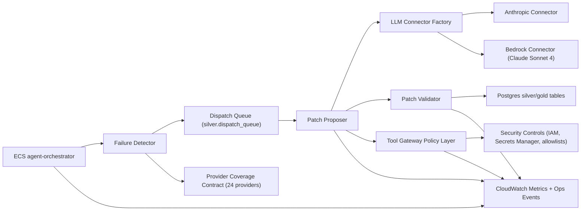

# AWS-Connected Ralph Loop Implementation (Claude Sonnet 4 Healing, 24 Providers)

## 1. Scope and Outcome
This implementation delivers a single agent-loop execution path with connector-pluggable LLM access (`anthropic` or `bedrock`), startup/runtime config hardening, versioned prompts, and provider-level telemetry from failure detection through patch proposal and validator handoff.

Primary flow now enforces end-to-end wiring:
- `orchestrator -> failure detector -> patch proposer -> validator bridge -> databases -> security/policy gates -> metrics/events`.

## 2. Architecture

## 3. Connector Matrix and Env Contract

### 3.1 Core agent connector variables
- `AGENT_LLM_CONNECTOR=anthropic|bedrock`
- `AGENT_LLM_MODEL=<model-id>`
- `AGENT_LLM_MAX_TOKENS=<int>`
- `AGENT_LLM_TEMPERATURE=<0..1>`
- `AGENT_LLM_PROMPT_VERSION=<version>`
- `AGENT_TELEMETRY_DIMS=<comma-separated optional override>`

### 3.2 Anthropic path
- `AGENT_ANTHROPIC_API_KEY` (local/dev allowed)
- `AGENT_ANTHROPIC_API_KEY_SECRET_ARN` (required in staging/prod when connector=anthropic)

Precedence:
1. resolved secret value into `AGENT_ANTHROPIC_API_KEY`
2. direct env `AGENT_ANTHROPIC_API_KEY`
3. legacy fallback `ANTHROPIC_API_KEY`

### 3.3 Bedrock path
- `AGENT_BEDROCK_REGION`
- `AGENT_BEDROCK_MODEL_ID`
- `AGENT_BEDROCK_MAX_TOKENS`
- `AGENT_BEDROCK_SECRET_ARN` (optional metadata/field source)

Allowed model-region policy (startup schema):
- `us-east-1` -> `anthropic.claude-sonnet-4-20250514-v1:0`
- `us-west-2` -> `anthropic.claude-sonnet-4-20250514-v1:0`

### 3.4 Environment defaults
- `local/dev`: default connector `anthropic`
- `staging/prod`: default connector `bedrock`

## 4. Prompt Strategy and Versioning
Prompt assets are versioned in:
- `backend/plane-b/src/agents/prompts/failure_triage.prompt.yaml`
- `backend/plane-b/src/agents/prompts/patch_proposal.prompt.yaml`
- `backend/plane-b/src/agents/prompts/validator_bridge.prompt.yaml`

`patch_proposal` prompt is loaded by `AGENT_LLM_PROMPT_VERSION` with deterministic fallback (`fallback-v1`) if prompt file/version is unavailable.

Required patch-response schema fields enforced:
- `providerId`
- `route`
- `detected_issue_class`
- `proposed_patch`
- `confidence`
- `risk_level`

Schema failures are fail-safe (proposal rejected) and metered via:
- `agent_prompt_schema_validation_failures`

## 5. Telemetry Contract (Loop Healing)
Metrics now include bounded, explicit dimensions:
- `provider_id`
- `route`
- `fetcher_source`
- `validator_module`
- `connector`
- `model`
- `run_id`
- `correlation_id`
- `outcome`
- `reason_code`

Required loop metrics:
- `agent_heal_attempt_count`
- `agent_heal_success_count`
- `agent_heal_blocked_count`
- `agent_llm_latency_ms`
- `agent_prompt_schema_validation_failures`

Provider evidence contract metrics:
- `agent_provider_healable_event` (per canonical provider per cycle)
- `agent_provider_coverage_gap_count`

## 6. 24-Provider Coverage Contract
Canonical provider list source:
- `backend/shared/provider-catalog.ts` -> `.remit-scout/providers/catalog.json`

Promotion gate condition:
- In the canary window, all 24 provider IDs must emit provider-healing telemetry evidence.
- Any missing provider is a hard promotion block.

Required artifact chain per provider:
- Failure bundle evidence
- Heal attempt telemetry
- Validator module result
- Final outcome metric

## 7. ECS/CDK Wiring
Implemented wiring in:
- `infrastructure/cdk/lib/ecs-tasks.ts`
- `infrastructure/cdk/lib/remit-scout-stack.ts`
- `backend/scripts/aws/agent-orchestrator-ecs.ts`
- `backend/scripts/aws/stress-responder-ecs.ts`

Delivery details:
- Connector env vars injected into shared ECS task env contract.
- Anthropic API key secret can be injected as ECS secret (`AGENT_ANTHROPIC_API_KEY`).
- Optional Bedrock secret supports region/model extraction.
- Startup checks in orchestrator ECS resolve secrets and hard-fail in non-dev when connector config is incomplete.

## 8. Deployment and Promotion Gates

### 8.1 Staging canary
- Connector mode validated (`anthropic` and `bedrock` paths contract-tested).
- LLM startup validation logs clean.
- Zero schema validation failures in synthetic canary.
- 24-provider coverage evidence present.

### 8.2 Production blue/green
- Same SHA proven in staging with loop telemetry and provider evidence.
- Blue environment receives updated connector contract.
- Green cutover only after telemetry and health thresholds pass.

### 8.3 Rollback drill readiness
- Pre-deploy rollback path validated and documented.
- Last-known-good image and env contract snapshot captured.

## 9. Evidence Artifacts (Bounded + Rollback)
For each major step, attach both bounded evidence and rollback evidence notes.

- Step: connector/env deployment
  - bounded evidence note: startup validation log + config matrix snapshot
  - rollback evidence note: previous task definition revision + previous secret ARN references

- Step: prompt/version rollout
  - bounded evidence note: selected prompt version + schema pass rate
  - rollback evidence note: prior prompt version pin + fallback confirmation

- Step: telemetry contract rollout
  - bounded evidence note: metric payload samples with required dimensions
  - rollback evidence note: prior dashboard query + threshold restoration plan

- Step: canary/provider coverage
  - bounded evidence note: 24/24 provider-healable-event confirmation
  - rollback evidence note: promotion blocked artifact + rollback drill run URL

## 10. Validation Plan

### Unit tests
- connector factory/config matrix (`anthropic` + `bedrock`)
- prompt schema enforcement for malformed LLM output

### Integration tests
- anthropic and bedrock connector contract stubs
- ECS env/secrets simulation for startup validation

### Infra checks
- IAM/SecretsManager access checks at startup
- no env contract drift against runbook + AGENTS checklist

## 11. Risk Controls
- Bedrock model/region mismatch: startup allowlist validation
- Prompt drift: version pinning + schema fail-fast
- High cardinality risk: bounded dimensions only
- Secret leakage: no raw secret values logged; only presence/ARN refs
